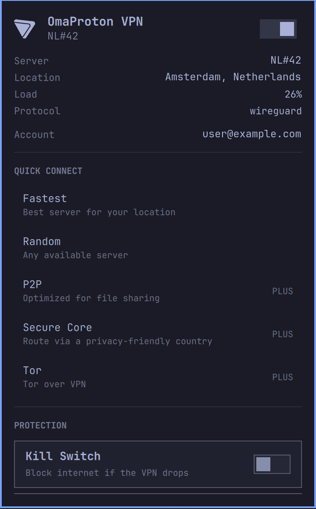
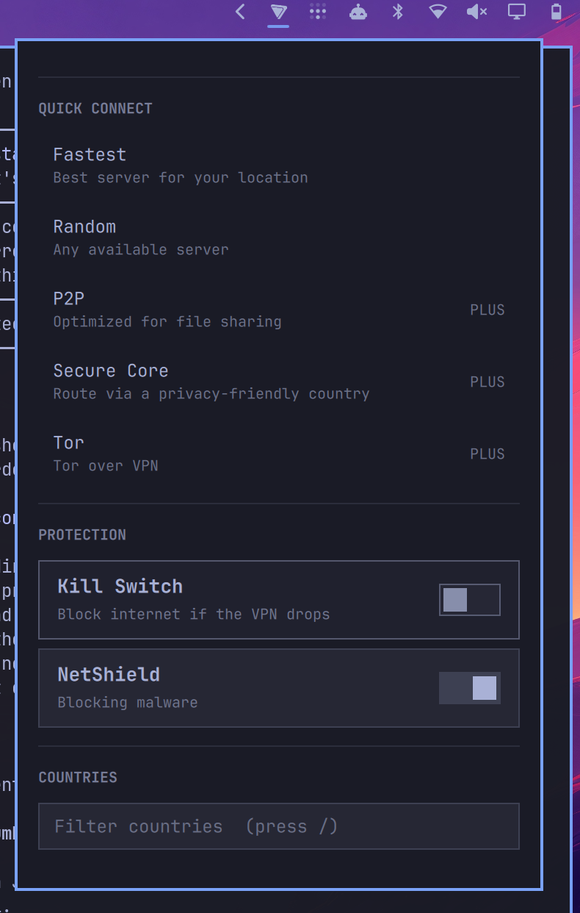
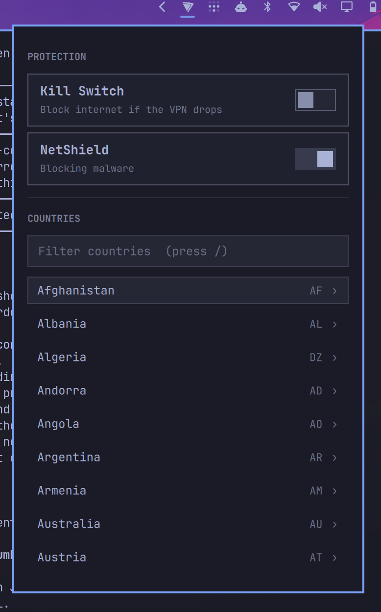
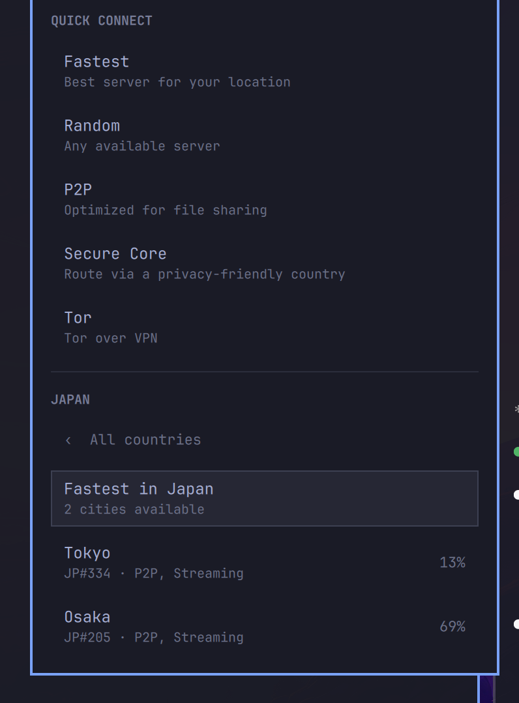

# OmaProton VPN

All of Proton VPN in one simple bar widget for [Omarchy Quattro](https://omarchy.org).
Install the CLI, sign in, connect, pick a city, switch on the Kill Switch — every
step happens in the panel, and none of them need a terminal. Click the Proton mark,
and you're protected.

It's drawn entirely from Omarchy's theme tokens — colours, font, corners, the
Proton mark itself — so it looks native in every theme, light or dark, and
follows along the moment you switch.

It drives the official `protonvpn` CLI. No API keys, no tokens, and no
credentials are stored by this plugin — your password and 2FA code go straight
into the CLI's own prompt, and Proton's client owns the session from there.




## What you need

- Omarchy Quattro
- A Proton account — a free one works; sign up at [proton.me](https://proton.me)

That's it. The panel installs the Proton VPN CLI for you if it isn't there.

## Install

```bash
omarchy plugin add https://github.com/grichard99/omarchy-protonvpn-plugin --enable
```

Then click the Proton mark in your bar. The panel walks you through the rest:

1. **Install Proton VPN CLI** — one click; Omarchy opens a terminal and handles
   the install (that terminal asks for your password, since it's a system
   package).
2. **Sign in** — type your Proton username or email in the panel and press
   Enter. A terminal opens for your password and 2FA code, then closes.
3. **Turn on the Kill Switch** — the panel offers this once. Say yes.
4. **Connect** — the switch at the top, or pick a city below.

If you'd rather place the widget yourself, drop `--enable` and run:

```bash
omarchy plugin enable io.github.grichard99.protonvpn right
```

### Already have the Proton VPN desktop app?

The desktop app and the CLI can't run at the same time. The panel warns you if
the app is installed. Quit it before connecting, or remove it:

```bash
omarchy pkg drop proton-vpn-gtk-app
```

### Two-factor with a security key?

The CLI supports TOTP (authenticator-app codes) only. If your account uses a
FIDO2 key, sign in once with the desktop app instead — this widget reads the
session either way.

## Update

```bash
omarchy plugin update io.github.grichard99.protonvpn
```

## Remove

```bash
omarchy plugin remove io.github.grichard99.protonvpn
```

That disables the widget, removes it from your bar, and deletes the plugin
folder. It leaves your Proton VPN session, settings, and any active tunnel
alone — disconnect and sign out first if you want those gone too:

```bash
protonvpn disconnect
protonvpn signout
```

The widget also keeps a small file of your recent locations at
`~/.local/state/omarchy-protonvpn/state.json`; delete it if you like.

## How to use it

### The bar icon

The Proton mark sits in your bar in the theme's foreground colour. Solid means
protected; dimmed means not.

| Action | What it does |
| --- | --- |
| Left-click | Open the panel |
| Right-click | Toggle — connect to the fastest server, or disconnect |
| Middle-click | Force a status refresh |

The panel is keyboard-driven too: arrow keys move through every section, `Enter`
activates, `→` opens a country's city list, `←` backs out, `Esc` backs out of a
city list or closes the panel. `/` jumps to the country filter. There are no
single-letter shortcuts on purpose — a stray keystroke should never change your
connection.

### The power switch

The switch at the top of the panel is the same toggle as right-click. When off,
it connects to the **fastest server for your location** — Proton's own choice,
the same thing `protonvpn connect` with no arguments does. When on, it
disconnects.

### Quick connect

Each row asks Proton for the **fastest server that has that feature**. You don't
pick a country here; Proton picks the best match for you.

| Row | What you get |
| --- | --- |
| **Fastest** | Proton's best pick for your location. Same as the power switch. |
| **Random** | Any available server, chosen at random. Useful when you want to look like you're somewhere unpredictable. |
| **P2P** | The fastest server that permits file sharing. Only P2P-flagged servers allow BitTorrent-style traffic; on other servers it's blocked. |
| **Secure Core** | The fastest Secure Core server. Your traffic enters through a hardened server in Switzerland, Iceland, or Sweden and *then* exits through the country you appear from — so a compromised exit server never sees your real IP. Slower, because it's two hops. |
| **Tor** | The fastest Tor-over-VPN server. Your traffic goes VPN first, then into the Tor network, so you can reach `.onion` sites from a normal browser. Noticeably slower. |

Rows marked **PLUS** need a paid plan. On a free plan they fail with a clear
"Requires a Proton VPN Plus plan" — nothing breaks.

### Protection



Two switches, saved to Proton's own settings:

- **Kill Switch** — if the VPN drops, your internet is blocked until it's back.
  Without this, a dropped tunnel silently falls back to your plain connection
  and all you'd see is the icon dimming. The CLI ships with it **off**, which is
  why the panel offers to turn it on the first time you sign in.
- **NetShield** — blocks malware, ads, and trackers at the DNS level. On a free
  plan Proton only allows malware blocking; the widget steps down to that
  automatically.

If the VPN does drop unexpectedly, you also get a desktop notification —
"Proton VPN disconnected — You're no longer protected." Turn notifications off
in the widget's settings if you'd rather not.

### Recent

The last three places you connected to, pinned above the country list. Most
people use the same two or three locations forever; this makes them one click.

### Countries and cities

Below that is the full country list. **Clicking a country doesn't connect** —
it drills into that country's cities, so you can see where you'll land before
you commit.





Inside a country:

- **"Fastest in &lt;country&gt;"** is always the first row. It lets Proton choose
  any server in that country, which is the same as `protonvpn connect --country`.
- **Every row below is one city**, showing the best server there right now with
  its current load and any tags — **Free** for free-plan servers, plus P2P, Tor,
  or Streaming. Cities are ordered by Proton's own speed score, best first.

The widget shows one row per city rather than one per server on purpose. Large
countries have thousands of servers and the nearest city would monopolise the
whole list — you'd scroll past hundreds of near-identical entries before seeing
a second city. When you pick a city, it connects to that city's best server; if
you want a *specific* server, use the CLI: `protonvpn connect US-NY#12`.

Secure Core servers aren't listed under their exit country. They're reached
through the Secure Core quick-connect row instead, since listing them here would
suggest a single-hop connection that isn't.

The city list comes from the Proton client's own cache, which is written the
first time you connect. Before that, every country shows only the "Fastest in"
row.

### The detail rows

When connected, the panel shows the server, its location, load, and protocol —
exactly what `protonvpn status` prints. Below that: your account.

The **Server** line updates within seconds from NetworkManager even while a
connect is still in progress. The other rows come from the CLI and can lag a
moment behind.

### While a connect is in progress

`protonvpn connect` blocks for anywhere from a few seconds to a minute. The
widget doesn't freeze — it shows "Connecting to …" and optimistically flips the
switch on. If the connect fails, the switch drops back and the reason is shown
under the header for a few seconds.

## Settings

Configurable from Omarchy's widget settings:

| Setting | Default | What it controls |
| --- | --- | --- |
| Desktop notifications | On | "Protected" on connect; "disconnected" if the tunnel drops unexpectedly. |
| Status refresh interval | 30 s | How often `protonvpn status` runs for the detail rows while the panel is closed. Open panel: every 5 s. |
| Link watch interval | 4 s | How often `nmcli` is polled for the bar icon. |

**Protocol.** The one Proton setting the CLI doesn't expose. It lives in
`~/.config/Proton/VPN/settings.json`:

```json
{ "protocol": "wireguard" }
```

Valid values are `wireguard`, `openvpn-udp`, and `openvpn-tcp`. Reconnect after
changing it. `wireguard` is the fastest and the CLI warns about instability on
`openvpn-tcp`.

## Security and privacy

This plugin runs unsandboxed inside the Omarchy shell process, like every
Omarchy plugin. It:

- stores no credentials, tokens, or account data
- makes no network requests of its own
- never uses `sudo` — the CLI install runs through Omarchy's own installer in a
  terminal that owns the password prompt
- never downloads or executes remote code
- runs every command as an argument list, never through a shell — with one
  exception below
- reads Proton's server cache read-only, and writes exactly one file of its own
  (`~/.local/state/omarchy-protonvpn/state.json`: recent location labels and
  whether you dismissed the Kill Switch prompt)

**Sign-in.** Your password and 2FA code go straight to the `protonvpn` CLI's
own prompt in a terminal; this plugin never sees them. The username you type in
the panel is the one value that has to cross a shell boundary (Omarchy's
terminal launcher takes a command string). It's checked against a strict
allow-list — letters, digits, and `. _ + @ -` only — and single-quoted before
it goes anywhere; anything else is refused with a message, not escaped. The
terminal runs non-interactively, so nothing lands in your shell history.

**Settings writes.** The Kill Switch and NetShield switches run
`protonvpn config set`. The widget will only ever pass `kill-switch` ∈
`{off, standard}` and `netshield` ∈ `{off, malware-only, malware-ads-trackers}`;
no other key or value can reach the CLI from this code.

**What's visible to other processes.** Omarchy exposes every plugin over a
Quickshell IPC socket under `/run/user/<uid>/`, which only your own user (and
root) can reach. Through it, any process running as you can call this widget's
`connect`, `disconnect`, `status`, and `debug` methods — the same things that
process could already do by running `protonvpn` directly. `status` returns the
server name; `debug` deliberately omits your account email. The email is shown
only inside the panel.

**Network activity.** The widget polls `nmcli` (local, no network) for the bar
icon, and `protonvpn status` for the detail rows. `status` asks the Proton
client for its server list, which the client refreshes from Proton's API only
when its own cache has expired — server loads every ~15 minutes, the full list
every ~3 hours — and only while connected. The widget's polling doesn't add API
traffic beyond what the client already does on its own schedule.

**Notifications** go through `notify-send` and contain only the connection
state and server name.

**On screen.** The panel shows your Proton account email. If you screenshot or
screen-share the open panel, that's visible.

## Notes

**How state is detected.** `protonvpn status` costs about a second of Python
start-up, which is far too slow to poll for a bar icon. The tunnel also appears
as an active NetworkManager connection named `ProtonVPN <server>` on device
`proton0`, which `nmcli` reports in around ten milliseconds. The widget polls
`nmcli` for the icon and only shells out to the CLI for the detail rows. Proton's
IPv6 leak guard (`pvpn-killswitch-ipv6`, on a dummy device) stays active
independently and is deliberately not counted as a live tunnel.

**Where the city list comes from.** The CLI has no server-list command
(`protonvpn servers` just prints a URL), but the Proton client caches the full
logical server list at `~/.cache/Proton/VPN/serverlist.json` and refreshes it on
every connect. `servers.py` reads that cache read-only and collapses it to one
row per city.

## Credits

The Proton VPN mark is drawn from the [Simple Icons](https://simpleicons.org)
path (CC0) and recoloured to the active theme, so it isn't a scaled bitmap.
Proton and Proton VPN are trademarks of Proton AG. This is an unofficial
community plugin and is not affiliated with or endorsed by Proton AG.

## License

[MIT](LICENSE)
