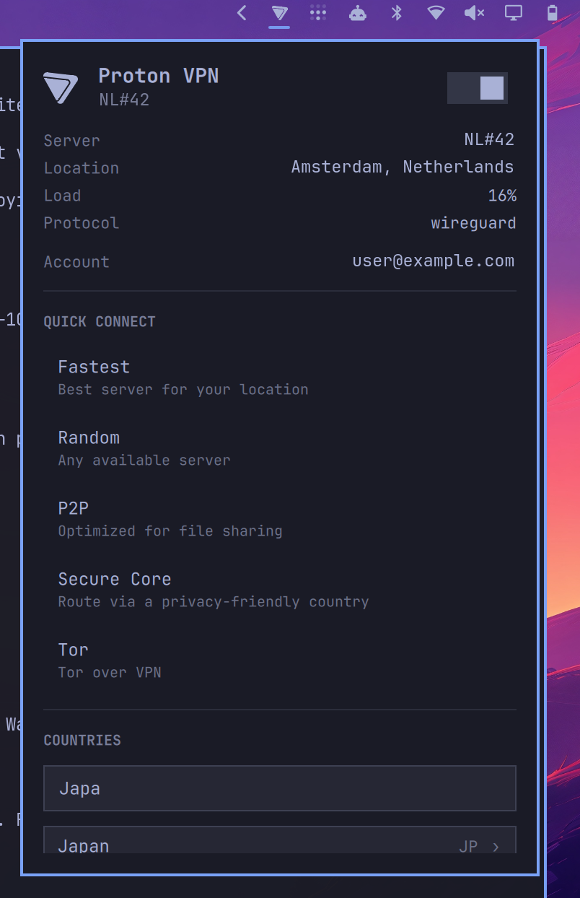

# Proton VPN for Omarchy

A bar widget for [Omarchy Quattro](https://omarchy.org) that puts Proton VPN in
your status bar: connection state at a glance, one-click connect and disconnect,
quick-connect by feature, and a country and city picker.

It drives the official `protonvpn` CLI. No API keys, no tokens, and no
credentials are stored by this plugin — sign-in happens in the CLI's own
interactive prompt, and Proton's client owns the session from there.



## Requirements

| Dependency | Where it comes from | Why |
| --- | --- | --- |
| Omarchy Quattro | — | Host shell (Quickshell) |
| `proton-vpn-cli` | Arch `extra` repo | Every VPN action |
| `python3` | Base system | Reads the client's cached server list |
| `nmcli` (NetworkManager) | Base system | Fast tunnel-state detection |
| `omarchy-launch-floating-terminal-with-presentation` | Omarchy | Interactive sign-in |

Install the CLI from the official repository, not the AUR:

```bash
omarchy pkg add proton-vpn-cli      # or: sudo pacman -S proton-vpn-cli
```

## Install

```bash
omarchy plugin add https://github.com/grichard99/omarchy-protonvpn-plugin --enable
```

That clones the plugin into `~/.config/omarchy/plugins/` and enables it. If you
prefer to place it yourself, drop `--enable` and run:

```bash
omarchy plugin enable io.github.grichard99.protonvpn right
```

Then sign in — click the widget and follow the terminal prompt, or run:

```bash
protonvpn signin <YOUR_PROTON_USERNAME>
```

The CLI asks for your password and then a TOTP token. **The CLI supports TOTP
two-factor only**; if your account uses a FIDO2 security key, sign in once with
the Proton VPN GTK app instead — this widget reads the session the client
creates either way.

## Update

```bash
omarchy plugin update io.github.grichard99.protonvpn
```

## Remove

```bash
omarchy plugin remove io.github.grichard99.protonvpn
```

That disables the widget, removes it from your bar, and deletes the plugin
folder. It does not touch your Proton VPN session, settings, or any active
tunnel — disconnect and sign out from the widget or the CLI first if you want
those gone too:

```bash
protonvpn disconnect
protonvpn signout
```

## How to use it

### The bar icon

The Proton mark sits in your bar in the theme's foreground colour. Solid means
connected; dimmed means disconnected, signed out, or the CLI isn't installed.

| Action | What it does |
| --- | --- |
| Left-click | Open the panel |
| Right-click | Toggle — connect to the fastest server, or disconnect |
| Middle-click | Force a status refresh |

The panel is keyboard-driven too: arrow keys move, `Enter` activates, `→` opens
a country's city list, `←` backs out, `Esc` backs out of a city list or closes
the panel. `/` jumps to the country filter, `c` connects to the fastest server,
`d` disconnects.

### The power switch

The switch at the top of the panel is the same toggle as right-click. When off,
it connects to the **fastest server for your location** — Proton's own choice,
the same thing `protonvpn connect` with no arguments does. When on, it
disconnects.

### Quick connect

Each row asks Proton for the **fastest server that has that feature**. You don't
pick a country here; Proton picks the best match for you.

| Row | What you get |
| --- | --- |
| **Fastest** | Proton's best pick for your location. Same as the power switch. |
| **Random** | Any available server, chosen at random. Useful when you want to look like you're somewhere unpredictable. |
| **P2P** | The fastest server that permits file sharing. Only P2P-flagged servers allow BitTorrent-style traffic; on other servers it's blocked. |
| **Secure Core** | The fastest Secure Core server. Your traffic enters through a hardened server in Switzerland, Iceland, or Sweden and *then* exits through the country you appear from — so a compromised exit server never sees your real IP. Slower, because it's two hops. |
| **Tor** | The fastest Tor-over-VPN server. Your traffic goes VPN first, then into the Tor network, so you can reach `.onion` sites from a normal browser. Noticeably slower. |

Secure Core, Tor, and P2P are paid-plan features. On a free plan they'll fail
with a message from the CLI; nothing breaks.

### Countries and cities

Below quick connect is the full country list. **Clicking a country doesn't
connect** — it drills into that country's cities, so you can see where you'll
land before you commit.

Inside a country:

- **"Fastest in &lt;country&gt;"** is always the first row. It lets Proton choose
  any server in that country, which is the same as `protonvpn connect --country`.
- **Every row below is one city**, showing the best server there right now with
  its current load and any feature tags (P2P, Tor, Streaming). Cities are
  ordered by Proton's own speed score, best first.

The widget shows one row per city rather than one per server on purpose. Large
countries have thousands of servers and the nearest city would monopolise the
whole list — you'd scroll past hundreds of near-identical entries before seeing
a second city. When you pick a city, it connects to that city's best server; if
you want a *specific* server, use the CLI: `protonvpn connect US-NY#12`.

Secure Core servers aren't listed under their exit country. They're reached
through the Secure Core quick-connect row instead, since listing them here would
suggest a single-hop connection that isn't.

The city list comes from the Proton client's own cache, which is written the
first time you connect. Before that, every country shows only the "Fastest in"
row.

### The detail rows

When connected, the panel shows the server, its location, load, and protocol —
exactly what `protonvpn status` prints. Below that: your account and plan.

The **Server** line updates within seconds from NetworkManager even while a
connect is still in progress. The other rows come from the CLI and can lag a
moment behind.

### While a connect is in progress

`protonvpn connect` blocks for anywhere from a few seconds to a minute. The
widget doesn't freeze — it shows "Connecting to …" and optimistically flips the
switch on. If the connect fails, the switch drops back and the CLI's error is
shown under the header for a few seconds.

## Settings

Configurable from Omarchy's widget settings:

| Setting | Default | Range | What it controls |
| --- | --- | --- | --- |
| Status refresh interval | 30 s | 5–3600 s | How often `protonvpn status` runs for the detail rows while the panel is closed. Open panel: every 5 s. |
| Link watch interval | 4 s | 2–60 s | How often `nmcli` is polled for the bar icon. |

## Recommended CLI settings

None of these are the widget's job, but a VPN widget that looks "connected" is
only as trustworthy as the tunnel underneath it. Worth running once:

```bash
protonvpn config set kill-switch standard
```

With the kill switch **off** (the CLI's default), a dropped tunnel silently
falls back to your plain connection and the bar icon just dims. With
`standard`, traffic is blocked instead until you reconnect or deliberately
disconnect.

```bash
protonvpn config set netshield malware-ads-trackers   # paid plans
```

**Protocol.** The protocol isn't settable through `protonvpn config`; it lives in
`~/.config/Proton/VPN/settings.json`:

```json
{ "protocol": "wireguard" }
```

Valid values are `wireguard`, `openvpn-udp`, and `openvpn-tcp`. Reconnect after
changing it. `wireguard` is the fastest and the CLI warns about instability on
`openvpn-tcp`.

## Security and privacy

This plugin runs unsandboxed inside the Omarchy shell process, like every
Omarchy plugin. It:

- stores no credentials, tokens, or account data
- makes no network requests of its own
- writes nothing outside its own folder, and reads Proton's cache read-only
- shells out only to `protonvpn`, `nmcli`, `python3`, and Omarchy's own
  terminal launcher — always as an argument list, never through a shell
- never uses `sudo` and never downloads or executes remote code

**Sign-in.** Credentials go straight to the `protonvpn` CLI's own prompt in a
terminal; this plugin never sees your password or TOTP. The username is read
with `read -rp` inside that terminal and passed to the CLI as an argument, so
it doesn't land in your shell history.

**What's visible to other processes.** Omarchy exposes every plugin over a
Quickshell IPC socket under `/run/user/<uid>/`, which only your own user (and
root) can reach. Through it, any process running as you can call this widget's
`connect`, `disconnect`, `status`, and `debug` methods — the same things that
process could already do by running `protonvpn` directly. `status` returns the
server name; `debug` deliberately omits your account email. The email is shown
only inside the panel.

**Network activity.** The widget polls `nmcli` (local, no network) for the bar
icon, and `protonvpn status` for the detail rows. `status` asks the Proton
client for its server list, which the client refreshes from Proton's API only
when its own cache has expired — server loads every ~15 minutes, the full list
every ~3 hours — and only while connected. The widget's polling doesn't add API
traffic beyond what the client already does on its own schedule.

**On screen.** The panel shows your Proton account email. If you screenshot or
screen-share the open panel, that's visible.

## Notes

**How state is detected.** `protonvpn status` costs about a second of Python
start-up, which is far too slow to poll for a bar icon. The tunnel also appears
as an active NetworkManager connection named `ProtonVPN <server>` on device
`proton0`, which `nmcli` reports in around ten milliseconds. The widget polls
`nmcli` for the icon and only shells out to the CLI for the detail rows. Proton's
IPv6 leak guard (`pvpn-killswitch-ipv6`, on a dummy device) stays active
independently and is deliberately not counted as a live tunnel.

**Where the city list comes from.** The CLI has no server-list command
(`protonvpn servers` just prints a URL), but the Proton client caches the full
logical server list at `~/.cache/Proton/VPN/serverlist.json` and refreshes it on
every connect. `servers.py` reads that cache read-only and collapses it to one
row per city.

## Credits

The Proton VPN mark is drawn from the [Simple Icons](https://simpleicons.org)
path (CC0) and recoloured to the active theme, so it isn't a scaled bitmap.
Proton and Proton VPN are trademarks of Proton AG. This is an unofficial
community plugin and is not affiliated with or endorsed by Proton AG.

## License

[MIT](LICENSE)
